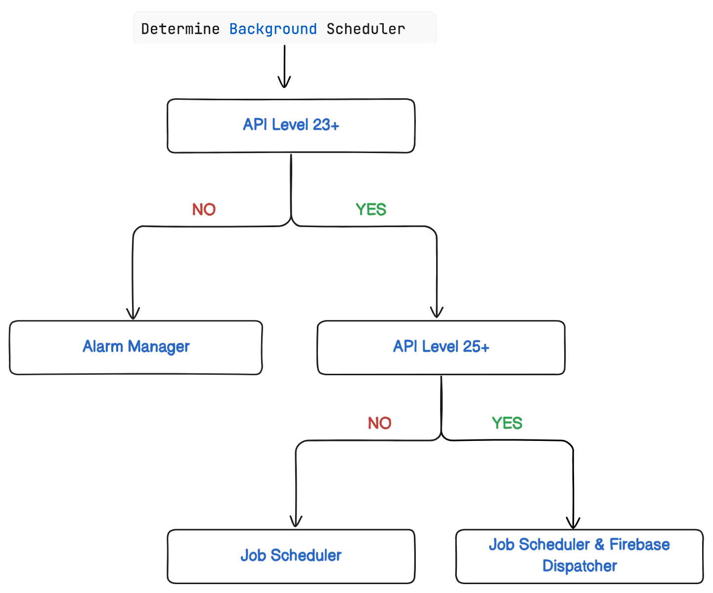
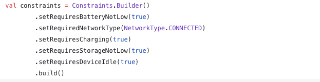
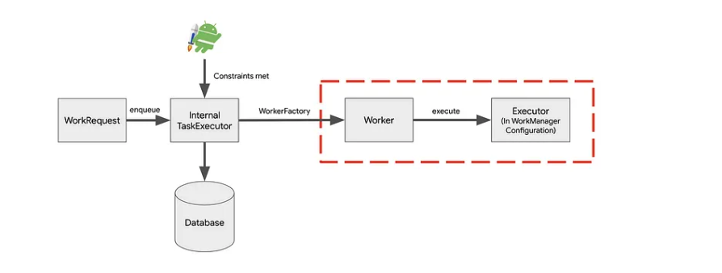

# Overview
Use Android Jetpack’s WorkManager API to schedule necessary background work, such as data backups or fresh content downloads, that keeps running even if the app exits or the device restarts.
- [X] Learn how to create a repository, add an offline cache, and schedule background tasks with WorkManager.
- [X] This app displays a list of videos. The app fetches a list of video URLs from the network using the Retrofit library and displays the list using a LazyColumn.
- Some of the APIs for background processing that Android provides includes:
   1. AlarmManager
   2. JobScheduler
   3. GCMNetworkManager
   4. Broadcast Receiver
# Content
- [X] What is WorkManager and when to use it
- [X] When to use it
- [X] Why use WorkManager?
- [X] How the WorkManager scheduler works
- [X] 

What is WorkManager and when to use it
---------------
1. WorkManager - is an Android Jetpack Library that handles background work that needs to run when various constraints are met, regardless of whether the application process is alive or not.
2. Background work can be started when:- 
   - the app is in the background
   - the app is in the foreground, 
   - the app starts in the foreground but goes to the background. 
3. Regardless of what the application is doing, background work should continue to execute, or be restarted if Android kills its process.

    ** When to use WorkManager **
   --------
When the task -
- [X] Can be deferred to be executed.
- [X] Needs to be finished (Is guaranteed to run even after the app is killed or device is restarted.)
- [X] Doesn't need to run at a specific time.
- [X] Has to meet constraints like battery supply,network availability before execution.
- [X] Ref: https://android-developers.googleblog.com/2018/10/modern-background-execution-in-android.html   

   ** Why use WorkManager? **
    -------------------------
1. * Backward Compatibility: WorkManager is designed to be backward compatible and automatically chooses the best 
    implementation for scheduling tasks based on the device's API level.It uses AlarmManager for API levels before 23, 
    JobScheduler for API levels 23 and 24, and a combination of JobScheduler and Firebase JobDispatcher for API levels 25 and higher.

2. * Flexibility in Scheduling: WorkManager allows you to schedule work requests that can be run immediately, at a later time, or repeatedly at specific intervals. 
    It also allows you to schedule tasks with various constraints, such as network availability, charging status, and device idle state. This flexibility ensures that tasks run when the required conditions are met. 
    WorkManager uses a combination of foreground and background threads to ensure that work requests are executed efficiently and reliably. 

3. * Guaranteed Execution: WorkManager provides a guarantee that tasks will be executed, even if the application is killed or the device is rebooted. 

4. * Custom Constraints: Apart from built-in constraints, WorkManager allows you to define custom constraints for your tasks. 
    This gives you fine-grained control over when and how your background tasks should be executed.

5. * Automatic Backoff Policy: WorkManager includes a back-off policy that helps handle the retry mechanism for failed tasks. 
    In case of a failure, WorkManager automatically applies a back-off strategy before retrying the task, 
    preventing constant retries in the case of persistent failures.

6. WorkManager provides a WorkInfo API: WorkInfo API allows you to query the status of your work requests. 
    You can use this API to check whether a work request is running, succeeded, failed, or canceled. 
    You can also retrieve output data from a completed work request using the WorkInfo API.

7. Support Chained Tasks:
   You can create a chain of dependent tasks using WorkManager, where one task triggers the next upon completion. 
   This enables you to organize and execute a sequence of background tasks.

How the WorkManager scheduler works
-----
To ensure compatibility back to API level 14, WorkManager chooses an appropriate way to schedule a background task depending on the device API level.
It uses AlarmManager for API levels before 23, JobScheduler for API levels 23 and 24, and a combination of JobScheduler and Firebase JobDispatcher for API levels 25 and higher.

WorkManager Classes
---
- [X] Worker - Defines what the work does
- [X] WorkRequest - defines how and when work should run
- [X] WorkManager

1.Worker
----
- Worker is an abstract class that performs work synchronously or asynchronously using CoroutineWorker on a background thread provided by WorkManager.
- It contains a dowork() that returns a Result which is used to return the status of our worker task:
  1. Result.success(): Indicates that the Worker has completed its task successfully.
  2. Result.retry(): Indicates that the Worker encountered a retryable error and should be retried later.
  3. Result.failure(): Indicates that the Worker encountered an unretryable (failed) error.
- Worker Accept inputs and produce outputs. Both inputs and outputs are represented as key, value pairs. 
NB: The input and output are passed as Data. Data objects are intended to be fairly small — there’s actually a limit on the total size that can be
input/output. This is set by the MAX_DATA_BYTES. If you need to pass more data in and out of your Worker, you should put your data elsewhere, 
such as a Room database. Eg passing the image uri instead of image itself

2.WorkRequest
----
- WorkRequest is also an abstract class that defines how and when work should run. It specifies parameters or constraints for work that should be enqueued in WorkManager.

   Types of Work Requests
   ----
   1. OneTimeWorkRequest - Runs once and then stops
   2. PeriodicWorkRequest - Runs tasks at specific intervals, such as once a day or once an hour until it is cancelled.
  
   A few important points to keep in mind when working with PeriodicWorkRequest:
  ---
  1. [x] The work is run multiple times
  2. [x] The work keeps on executing periodically until it is cancelled
  3. [x] The first execution happens immediately after the mentioned **constraints ** are met and the next execution occurs after the mentioned **period of time**
  4. [x] Recurring execution doesn’t begin if the constraints mentioned with that work request are not met
  5. [x] The minimum time that needs to pass before a repeated task can be executed once again is 15 minutes
  6. [x] The work cannot be chained with other work requests

      WorkManager Constraints
      ---
1. [x] Constraints are Predefined set of conditions that the system should satisfy before starting our work. Like the task can be battery efficient by checking it’s not running heavy tasks on the low battery case, etc.
2. [x] Work restrictions guarantee that work is postponed until ideal circumstances are fulfilled.
3. [x] WorkManager API provides the criteria listed below:
     - NetworkType
     - BatteryNotLow
     - RequiresCharging
     - DeviceIdle
     - StorageNotLow
    
    
    BackOff Criteria
    ----
    [x] It allows you to define when the work should be retried.
       1. [x] The backoff criteria is defined by:
         - [X] BackoffPolicy - The BackoffPolicy to use when increasing backoff time, which by default is exponential, but can be set to linear.
         - [X] Duration - Time to wait before retrying the work, which by defaults to 10 seconds.
    
    Unique Work
     --
     - Sometimes we want to schedule the same work multiple times, but when a work has already been scheduled, 
       we want the new work to replace the existing task or simply ignore the new work. 
     - Call WorkManager.enqueueUniqueWork()to schedule unique time work, or call WorkManager.enqueueUniquePeriodicWork()to row periodic work process uniqueness.
    
        ExistingWorkPolicy
        ---
     - ExistingWorkPolicy is the policy that should be taken when there is already a work scheduled.

        - REPLACE: If a work already exists with the same name, replace it with this new work. Previous work will be stopped and deleted.
        - KEEP: If a work already exists with the same name, do nothing. Original work will continue as it is.
        - APPEND: append the new work to already existing work.
        - APPEND_OR_REPLACE: If previous work failed, it’ll create a new sequence, else it behaves like APPEND.
        - ExistingPeriodicWorkPolicy.UPDATE: If there is existing pending (uncompleted) work with the same unique name, it will be updated with the new specification.
   
   Chaining of Tasks:
   ---
   - We can chain multiple tasks in two ways.
     1. Chaining in Series - The second worker will only execute if the first one completes successfully. 
        You can extend this chain by adding more workers with continuation.then() 
        Example:
        `workManager.beginWith(oneTimeFetchWR)
        .then(notificationWorkReq)
        .enqueue()`
     2. Parallel Chaining - The tasks are executed simultaneously
        Example:
        `.beginWith(listOf(firstWorkerRequest, secondWorkerRequest, thirdWorkerRequest))
        .then(fourthWorkerRequest)
        .then(fifthWorkerRequest)
        .enqueue()`

WorkManager
--

- **Behind the Scenes — How work runs **
By default, WorkManager will:
- Run your work off of the main thread.
- Guarantee your work will execute (it won’t forget to run your work, even if you restart the device or the app exits).
- Run according to best practices for the user’s API level.

Let’s explore how WorkManager ensures your work is run off of the main thread and is guaranteed to execute. 
- Behind the scenes, WorkManager includes the following parts:

When you enqueue your WorkRequest:
1. The Internal TaskExecutor immediately saves your WorkRequest info to the WorkManager database.
2. Later, when the Constraints for the WorkRequest are met (which could be immediately), the Internal TaskExecutor tells the WorkerFactory to create a Worker.
3. Then the default Executor calls your Worker’s doWork() method off of the main thread.

    More Info:
    ---
   - [X] Internal TaskExecutor: A single threaded Executor that handles all the requests to enqueue work.
   - [X] WorkManager database: A local database that tracks all of the information and statuses of all of your work. 
      This includes things like the current state of the work, the inputs and outputs to and from the work and any constraints on the work. 
      This database is what enables WorkManager to guarantee your work will finish — if your user’s device restarts and work gets interrupted, all of the details of the work can be pulled from the database and the work can be restarted when the device boots up again.
   - [X] WorkerFactory**: A default factory that creates instances of your Workers. 
   - [X] Default Executor**: A default executor that runs your work unless you specify otherwise. This ensures that by default, your work runs synchronously and off of the main thread.

- Ref: https://medium.com/@appdevinsights/work-manager-android-6ea8daad56ee - Basic Components of WorkManager
- https://medium.com/androiddevelopers/workmanager-basics-beba51e94048 - 

Background work
--

 Ref:
- Background work: https://developer.android.com/develop/background-work/, https://medium.com/@appdevinsights/work-manager-android-6ea8daad56ee
